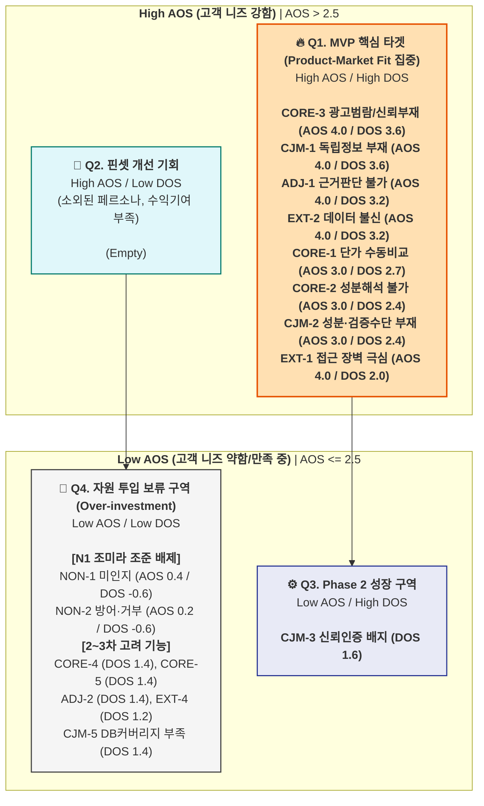
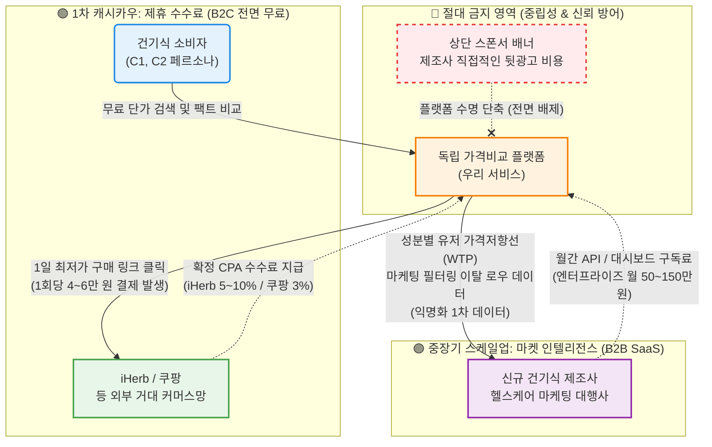

# Value Proposition Sheet Gemini3.1Pro V1

> **문서 버전:** Gemini3.1Pro V1 (통합)  
> **통합 원본:** `01_value-proposition-draft.md` + `02_job-feature-map+MVP-plan.md`  
> **작성 대상:** 건강보조식품 성분·가격 비교 플랫폼을 기획 중인 예비 창업자 및 초기 멤버  
> **작성 목적:** 페르소나, CJM, AOS-DOS, JTBD 데이터를 총망라하여 *누구에게, 어떤 본질적 가치를, 어떠한 차별성으로 제공하는지* 정의하고, 이를 실현하기 위한 MVP 개발 계획까지 단일 문서로 관리한다.

**엘리베이터 피치:** "수동 엑셀 계산과 뒷광고 필터링에 지친 건기식 소비자들을 위한, 리얼-타임 1일 단가 계산 및 의학 팩트체크 플랫폼"
**포지셔닝 선언:** 우리는 마케팅 노이즈를 100% 제거하고 오직 '1정당 찐 단가'와 '식약처/논문 뱃지'만을 제공하는 시장 내 유일한 독립(Neutral) 플랫폼이다.

## 1\. 타겟 오디언스 및 북극성 지표

  * **Primary 타겟 (캐시카우):** 한정훈 (C1, 가성비 최적화자) — 엑셀 환산러
  * **Secondary 타겟 (그로스):** 박소연 (C2, 건강관리자) & 정수빈 (A2, 트렌드 추종자) — 팩트체크 및 바이럴
  * **배제 타겟:** E1(디지털 소외), N1(브랜드 맹신러) — MVP 단계 마케팅/기획 자원 투입 전면 금지
  * **북극성 지표 (North Star Metric):** 탐색 시작 후 결제(또는 공유) 완료까지의 소요 시간 (TTC: Time-to-Conversion). 목표는 기존 60분에서 MVP 환경 하 5분 이내 압축.

-----

## 2\. 페르소나별 Pain 수치화 및 AOS-DOS 시장 기회 산출

페르소나 및 고객 여정지도(CJM) 분석을 토대로 도출된 Pain Point를 수치화(AOS)하고, TAM/SOM 비중 기반의 시장 가중치(MR)를 적용하여 기회 요인(DOS)을 산출했습니다.

### 2.1. AOS-DOS 종합 평가 매트릭스

*(AOS 산출: Importance × (1 - Satisfaction / 5) / DOS 산출: AOS × MR)*

| 순위 | Pain ID | 페르소나 분류 | AOS | MR 가중치 | 대상 세그먼트 시장성 종합 평가 | DOS |
| :--- | :--- | :--- | :--- | :--- | :--- | :--- |
| **1** | **CORE-3** | 🔵 핵심 (C2, C1) | 4.00 | **0.9** | Q1-A + Q4-A 100% 포괄. 전환의 첫 번째 조건 | **3.60** |
| **1** | **CJM-1** | 전 여정 (SEO 인지) | 4.00 | **0.9** | 신규 트래픽의 모든 유입 채널 대응 | **3.60** |
| **3** | **ADJ-1** | 🟢 확장 (A2) | 4.00 | **0.8** | Q4-C 트래픽 규모(트렌드 검색량 폭증) 방어 | **3.20** |
| **3** | **EXT-2** | 🔴 극단 (E2, C1) | 4.00 | **0.8** | C1(수익엔진)의 리텐션을 유지하기 위한 SLA | **3.20** |
| **5** | **CORE-1** | 🔵 핵심 (C1) | 3.00 | **0.9** | MVP 수수료 모델(SAM/SOM)의 55% 수익 직결 | **2.70** |
| **6** | **CORE-2** | 🔵 핵심 (C2) | 3.00 | **0.8** | Q4-A 탐색의 최초 허들. 여기서 통과 못하면 전환 0% | **2.40** |
| **6** | **CJM-2** | 전 여정 (고려 단계) | 3.00 | **0.8** | 미드퍼널 비교 도구 부재 해소 | **2.40** |
| **8** | **EXT-1** | 🔴 극단 (E1) | 4.00 | **0.5** | 직접 결제 확률 매우 낮아 MR 저감 | **2.00** |

### 2.2. AOS-DOS Combined Matrix 시각화

MVP의 필수 요구사항인 `Q1 혁신 기회 영역` (AOS \> 2.5 / DOS \> 1.5)을 도출합니다.

-----

## 3\. 솔루션 핵심 제안 (Value Proposition)

페르소나 분석과 JTBD(고객 수행 과제) 인터뷰 결과를 통합하여 우리의 비즈니스가 전달할 차별적 가치를 정의합니다.

| 항목 | 상세 서술 |
| :--- | :--- |
| **고객의 핵심 문제 (Pain)** | **① 단가 수동 계산의 한계:** 엑셀로 '1일 단가' 계산에 1시간 소요 (C1) **② 광고성 정보 공해:** 뒷광고 도배 및 성분 해독 불가 (C2, A2) **③ 데이터 오류 불신:** 기존 비교 앱의 오안내로 카테고리 전체 불신 (E2) |
| **고객 상황별 목표 (Job)** | **① 실시간 최적화 자동 렌더링:** 1일 복용량 단위 단가 즉시 확인 및 최적가 구매 **② 논문/의학 기반 필터링:** 마케팅 배제, 객관적 팩트 바탕으로 빠른 결정 및 카톡 공유 |
| **원하는 최종 성과 (Outcome)** | **① 탐색/계산 시간 90% 단축 (60분 → 5초)** **② 광고 수익 0 인증 & 직관적 1개 뱃지로 판독 강도 명세화** **③ 오류 0건, 1번의 탭으로 SNS/가족 카톡방 즉시 공유** |
| **기존 대안 (Competitors)** | 유튜브 약사 채널/커뮤니티(파편화로 시간 낭비), 개인용 엑셀 시트, 대형 제약사 범용 제품 타협 구매 |
| **핵심 제안 (Value Proposition)** | **"광고 없는 팩트, 엑셀 없는 최저가"** (건강보조식품 성분·가격 비교 초자동화 플랫폼) |
| **차별적 가치 (Unfair Advantage)** | **① 극한의 정규화:** 업계 유일 [실시간 환율 + 제품별 1일 복용 기준량 + 배송비 + 할인코드] 통합 연산 엔진 **② 100% 무결성 선언:** 상위 노출 뒷광고 및 제휴 마케팅비 전면 배제 플랫폼 |

### 3.1. Pain – Solution – Outcome 핵심 흐름도

```mermaid
flowchart LR
    classDef pain fill:#FFEbee,stroke:#EF5350,stroke-width:2px;
    classDef solution fill:#E8F5E9,stroke:#66BB6A,stroke-width:2px;
    classDef outcome fill:#E3F2FD,stroke:#42A5F5,stroke-width:2px;

    subgraph Pain ["🔥 Pain (고객의 불만/불안 지점)"]
        direction TB
        P1("1시간 낭비되는 엑셀 수동 단위 환산"):::pain
        P2("뒷광고로 도배된 영양제 리뷰 맹신 불가"):::pain
        P3("의학 용어와 정보 과잉으로 탐색 포기"):::pain
    end

    subgraph Solution ["💡 Solution (우리 플랫폼의 핵심 제안)"]
        direction TB
        S1("실시간 채널 통합 1일 단가 환산 엔진"):::solution
        S2("마케팅/제휴 제로의 독립적인 데이터 생태계"):::solution
        S3("의학 논문 기반 배지형 팩트 1탭 요약 카드"):::solution
    end

    subgraph Outcome ["🎯 Outcome (고객이 체감하는 최종 성과)"]
        direction TB
        O1("검색 5초 만에 신뢰도 100% 최저가 즉각 결제"):::outcome
        O2("지루한 성분 공부 해방 및 카카오톡 즉시 공유"):::outcome
        O3("마케팅 늪에서의 구원, 내 가족 건강의 보호"):::outcome
    end

    Pain ==> Solution ==> Outcome
```

-----

## 4\. 수익 구조 설계 및 비즈니스 모델 (Monetization)

'독립성'과 '무결성' 방어를 위해 **직접 브랜드 광고비 수취 모델은 전면 배제**합니다.

  * **1차 캐시카우 (수익성) - Affiliate CPA:** 결제 완료 시 수수료 발생. 평균 AOV 4\~6만원 기준, 1회 전환 당 1,200\~3,000원의 순수익 창출. C1 타겟의 재구매 라이프사이클(3\~6개월)에 따른 반복 매출 확보.
  * **중장기 스케일업 (성장성) - B2B Market Intelligence:** 가격 저항선 및 이탈률 로우 데이터를 B2B 대상 월 50\~150만 원 수준 SaaS로 판매.
  * **프리미엄 알림 구독 (지속가능성) - B2C SaaS:** 특정 제품 역대 최저가 도달 시 앱 푸시 알림 제공 (월 2,900\~4,900원 과금).

-----

## 5\. 전략적 제언 및 성공 측정 KPI

### 5.1 시니어 분석가 제언

1.  **N1(조미라)과 E1(나경아) 배제:** 플랫폼 직접 유치를 위한 마케팅 자원 투입을 금지하고, 카톡 요약 카드를 통한 간접 유입 플라이휠에 집중해야 합니다.
2.  **핵심 기술은 정규화(Normalization):** 이커머스의 파편화된 규격을 '1일 섭취 기준 단가'로 통일하는 데이터 엔지니어링이 초기 생존과 가장 거대한 해자(Moat)가 됩니다.
3.  **무결점이 곧 수익성 (Trust Deficit 방어):** 초기 수익을 위한 협찬 노출은 플랫폼 생명을 단축시킵니다. 도메인 자체를 무결점 청정구역으로 끝까지 방어해야 합니다.

### 5.2 성공 측정 KPI (MVP 검증)

| 구분 | 주요 KPI | MVP 1차 목표 수치 |
| :--- | :--- | :--- |
| **획득 (Acq)** | 건기식 / 영양제 검색어 SEO 노출 통한 오가닉 유입 | 월 방문자 10,000명 |
| **활성 (Act)** | 메인 화면 → 단가 산출 및 뱃지 화면으로의 퍼널 전환율 | 60% 이상 |
| **전환 (Rev)** | 비교 결과 화면 → '제휴사 구매처 링크(Affiliate)' 클릭률 | **15% 이상** (실제 클릭 발생 기반) |
| **바이럴 (Ref)** | 1세션 당 '카카오톡 공유하기 요약 카드' 발송 비율 | 생성 세션 10건당 1회 이상 (K-Factor 1.1) |
| **유지 (Ret)** | 영양제 재구매 주기 도래 시 (Day 30 \~ 60) 재방문율 | 20% 이상 |

-----

## 6\. MVP 구현 상세 계획 (Job-Feature Map 기반)

초기 스타트업의 자원과 법적/기술적 제약을 반영하여, 완벽한 앱 개발이 아닌 가설 검증과 즉각적인 수익 창출이 가능한 핵심 기능부터 우선 구현합니다.

### [Phase 1] Core Value 직결 기능 (우선순위: High)

수동 계산 과부하를 즉시 해결하고 플랫폼의 핵심 가치(신뢰)를 구축하는 필수 스펙입니다.

**1. 실시간 1일 단가 정규화 엔진 (Super-Calc Engine)**

  * **핵심 Job:** 1시간 걸리던 다채널 상이 용량/환율/배송비 계산을 5초 만에 단일 가격표로 통일.
  * **중요도 / 난이도:** 5 / 5
  * **리스크 (크롤링 차단):** 대형 채널 무단 크롤링 시 IP 차단 및 법적 분쟁 위험.
  * **대응 전략:** 공식 제휴 마케터 API(쿠팡 파트너스, iHerb Affiliate Open API)를 활용하여 합법적이고 안정적인 데이터 파싱 환경 구축.

**2. 식약처/논문 등급 배지 시스템 (Anti-BS Dashboard)**

  * **핵심 Job:** 허위/뒷광고를 전면 차단하고 텍스트 대신 3단계 신호등 배지로 팩트 제시.
  * **중요도 / 난이도:** 5 / 4
  * **리스크 (건기식 법률 위반):** 비의료인 플랫폼의 자의적 효능 해석 시 허위 과장 광고 심의 제재.
  * **대응 전략:** '건강기능식품공전'에 명시된 식약처 공식 인정 원료 텍스트만 그대로 래핑(Wrapping)하여 플랫폼의 법적 책임 원천 차단.

### [Phase 2] 트래픽 확산 및 신뢰 방어 기능 (우선순위: High \~ Mid)

Phase 1에서 검증된 가치를 외부로 전파하고, 이탈을 방어하는 시스템입니다.

**3. 1-Tap 팩트 요약 카톡 SNS 공유 (Viral Engine)**

  * **핵심 Job:** 지인 설득을 위해 복잡한 설명 대신 결론 카드 1장을 즉시 생성하여 전송.
  * **중요도 / 난이도:** 4 / 2
  * **리스크 (K-Factor 저하):** 공유 링크 클릭 시 회원가입/앱 설치 요구로 인한 극단적 이탈.
  * **대응 전략:** 앱 설치 강요 없이 카카오톡 내장 브라우저 웹뷰를 통해 '최저가 구매 외부 링크'로 마찰 없는 다이렉트 랜딩 설계.

**4. 라벨 원본 아카이브 및 제보 보상 (Data Trust System)**

  * **핵심 Job:** 데이터 불신 유저(E2)를 위해 실물 뒷면 라벨 시각화 및 48시간 내 정정 시스템 제공.
  * **중요도 / 난이도:** 3 / 3
  * **리스크 (OCR 인식 오류):** 무료 OCR 모델의 낮은 인식률이 오히려 잘못된 정보 제공 초래.
  * **대응 전략:** 억지 텍스트 변환 대신 매뉴얼 이미지 원본(JPEG) 팝업 제공 및 유저 크라우드소싱 기반의 "오류 1건 제보 리워드" 운영으로 방어.

### [Out of Scope] MVP 개발 범위 배제

  * **AI 문진 기반 맞춤 추천 / 리뷰 게시판 / 헬스케어 온보딩:** 기술 부채 증가 및 광고 침투(리뷰 게시판)를 초래하므로 MVP 검증 단계에서는 전면 배제 (중요도 1\~2 수준).