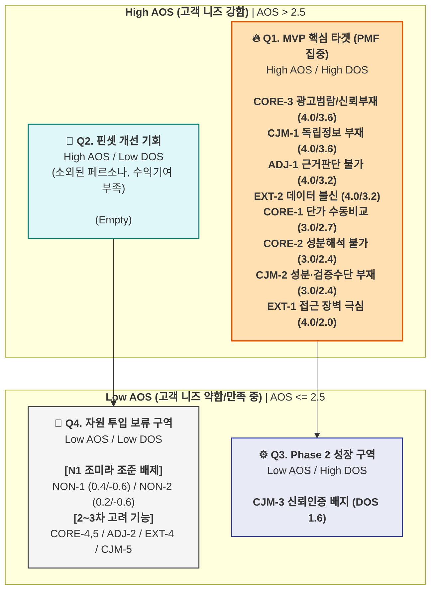
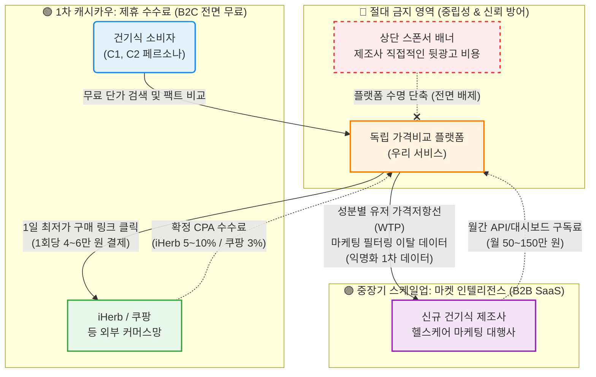

# 💡 Value Proposition Sheet — V1 통합본 (Opus4.6)

> **문서 버전:** Opus4.6 V1 (통합)  
> **통합 원본:** `01_value-proposition-draft.md` + `02_job-feature-map+MVP-plan.md`  
> **작성 대상:** 건강보조식품 성분·가격 비교 플랫폼을 기획 중인 예비 창업자 및 초기 멤버  
> **작성 목적:** 페르소나, CJM, AOS-DOS, JTBD 데이터를 총망라하여 *누구에게, 어떤 본질적 가치를, 어떠한 차별성으로 제공하는지* 정의하고, 이를 실현하기 위한 MVP 개발 계획까지 단일 문서로 관리한다.

---

## 📌 목차

| # | 섹션 | 내용 요약 |
|---|------|----------|
| Ⅰ | [Pain–Solution–Outcome 핵심 흐름도](#ⅰ-painsolutionoutcome-핵심-흐름도) | 고객 문제 → 솔루션 → 성과의 직관적 흐름 |
| Ⅱ | [타겟 & 문제 분석](#ⅱ-타겟--문제-분석) | 핵심 고객 정의 및 고통의 깊이 |
| Ⅲ | [AOS–DOS 결합 매트릭스](#ⅲ-aosdos-결합-매트릭스) | 페르소나별 Pain 수치화 및 시장 기회 산출 |
| Ⅳ | [JTBD 요약 카드](#ⅳ-jtbd-요약-카드) | 고객 Job 통합 및 핵심 Pain-Outcome 압축 |
| Ⅴ | [Value Proposition Sheet (핵심 가치 제안)](#ⅴ-value-proposition-sheet-핵심-가치-제안) | 솔루션 핵심 제안 총괄표 |
| Ⅵ | [수익 구조 설계](#ⅵ-수익-구조-설계) | Revenue Model & Monetization |
| Ⅶ | [전략적 제언](#ⅶ-전략적-제언) | 시니어 가치 분석가의 3가지 조언 |
| Ⅷ | [MVP 제품 비전 및 포지셔닝](#ⅷ-mvp-제품-비전-및-포지셔닝) | MVP 정의, 북극성 지표 |
| Ⅸ | [Job-Feature Map & MVP 기능 명세](#ⅸ-job-feature-map--mvp-기능-명세) | 기능 우선순위, 구현 난이도, 리스크 대응 |
| Ⅹ | [MVP 성공 측정 기준 & Next Steps](#ⅹ-mvp-성공-측정-기준--next-steps) | KPI 목표 및 실행 항목 |

---

## Ⅰ. Pain–Solution–Outcome 핵심 흐름도

우리 솔루션이 고객의 근본적 문제를 어떻게 해결하고 어떤 결과 가치를 창출하는지 보여주는 직관적 흐름입니다.

```mermaid
flowchart LR
    %% 스타일 정의
    classDef pain fill:#FFEbee,stroke:#EF5350,stroke-width:2px;
    classDef solution fill:#E8F5E9,stroke:#66BB6A,stroke-width:2px;
    classDef outcome fill:#E3F2FD,stroke:#42A5F5,stroke-width:2px;

    subgraph Pain ["🔥 Pain (고객의 불만/불안 지점)"]
        direction TB
        P1("1시간 낭비되는 엑셀 수동 단위 환산"):::pain
        P2("뒷광고로 도배된 영양제 리뷰 맹신 불가"):::pain
        P3("의학 용어와 정보 과잉으로 탐색 포기"):::pain
    end

    subgraph Solution ["💡 Solution (우리 플랫폼의 핵심 제안)"]
        direction TB
        S1("실시간 채널 통합 1일 단가 환산 엔진"):::solution
        S2("마케팅/제휴 제로의 독립적인 데이터 생태계"):::solution
        S3("의학 논문 기반 배지형 팩트 1탭 요약 카드"):::solution
    end

    subgraph Outcome ["🎯 Outcome (고객이 체감하는 최종 성과)"]
        direction TB
        O1("검색 5초 만에 신뢰도 100% 최저가 즉각 결제"):::outcome
        O2("지루한 성분 공부 해방 및 카카오톡 즉시 공유"):::outcome
        O3("마케팅 늪에서의 구원, 내 가족 건강의 보호"):::outcome
    end

    Pain ==> Solution ==> Outcome
```

---

## Ⅱ. 타겟 & 문제 분석

### 🎯 1. 타겟

저희 비즈니스는 **전체 1,200만 건기식 커머스 시장 내에서 가장 구매 관여도가 높은 2개의 핵심 그룹(SOM)**의 문제를 풉니다.

1. **엑셀 환산러 (C1, 한정훈):** 매번 복잡한 단위(정/g)와 실시간 환율, 배송비를 구글 시트에 엑셀로 일일이 입력하며 최저가를 찾는 **가성비 최적화자**.
2. **건강 계기 진입자 (C2, 박소연):** 가족의 질환 등 명확한 목적이 있으나, 무분별한 뒷광고와 어려운 성분명("콜레칼시페롤" 등) 때문에 결국 종근당 등 비싼 범용 제품에 타협하고 마는 **가족 건강 관리자**.

### 📉 2. 문제의 깊이

이는 피상적인 불편함이 아니라, 고객의 시간과 돈이 직접적으로 누수되는 **AOS 4.0(최고점) 수준의 치명적 고통**입니다.

- **고통의 깊이 (AOS):** 정보 탐색 및 수동 엑셀 계산에 **매회 60분 이상의 무수익 시간**을 강제당하고 있으며, 정보 비대칭(광고성 리뷰)으로 인한 분노와 불신이 극에 달해 있습니다 (AOS 분석 최고점 4.0).
- **시장의 크기와 기회 (DOS 3.6 / TAM-SOM):** 가구당 연평균 건기식 지출액은 **약 34만 원**이며, '독립성/광고 배제'라는 영역은 기존 네이버/쿠팡 생태계가 제 살을 깎아먹지 않고서는 결코 시도할 수 없는 **구조적 공백 시장(White Space)**입니다.

### 🚀 3. MVP 핵심 방향

우리의 MVP는 완벽한 헬스케어 슈퍼앱이 아닙니다. 고객의 **탐색 비용을 60분에서 5초로 압축**하는 단 두 가지 압도적인 '초자동화' 기능만 던집니다.

- **[Super-Calc 엔진]:** 직구 달러 환율부터 상이한 묶음 용량까지 파싱하여, 오직 **"1일 복용 기준 원화(₩) 최종 단가"** 하나로만 수직 정렬해버리는 채널 통합 가격 비교 API.
- **[Anti-BS 대시보드]:** 유저의 의사결정을 흐리는 체험단 블로그 잡음과 평점을 UI에서 100% 삭제하고, **식약처 DB 및 논문 근거에 기반한 '단 1개의 의학 뱃지(결론)'**만 제공.
- **(수익화):** 아웃링크 기반의 **제휴 수수료(iHerb 5~10%, 쿠팡 3%)**를 수취하여, 어떠한 브랜드 협찬 광고 없이도 자생할 수 있는 플라이휠을 구동합니다.

---

## Ⅲ. AOS–DOS 결합 매트릭스

### 1. 페르소나별 Pain 수치화 및 AOS 산출

**AOS 산출 공식:** `Importance × (1 - Satisfaction / 5)` *(Likert 5점 척도 기준)*

| 그룹 구분 | 페르소나 유형 | Pain ID | 핵심 Pain 내용 | Imp | Sat | AOS | 해석 |
| --- | --- | --- | --- | --- | --- | --- | --- |
| **🔵 핵심** | **C1 한정훈** (가성비) | CORE-1 | 채널 간 단가 비교 수동 작업 과부하 | 5 | 2 | **3.00** | 높은 중요도 대비 자동화 대안 부재 |
|  | **C2 박소연** (건강계기) | CORE-2 | 성분 정보 해석 불가 → 비교 불가 | 5 | 2 | **3.00** | 성분 리터러시 장벽으로 탐색 중단율 높음 |
|  | **C2 박소연** (건강계기) | CORE-3 | 광고성 콘텐츠 범람, 신뢰 정보 부재 | 5 | 1 | **4.00** | 독립 비교 플랫폼 가치의 핵심 |
|  | C1/C2 공통 | CORE-4 | 가격 적정성 판단 기준 부재 | 4 | 2 | **2.40** | 결제 전 막연한 찝찝함 유발 |
|  | C2 중심 | CORE-5 | 장시간 탐색에도 확신 있는 결론 실패 | 4 | 2 | **2.40** | 탐색을 포기하고 베스트셀러로 타협함 |
| **🟢 확장** | **A2 정수빈** (트렌드) | ADJ-1 | 트렌드 성분 과학적 근거 판단 불가 | 5 | 1 | **4.00** | 바이럴을 지탱할 팩트체크 부재 |
|  | **A2 정수빈** (트렌드) | ADJ-2 | 광고/진짜 구분 불가 + 가격 차이 근거 | 4 | 2 | **2.40** | 8배 가격 차이에 대한 납득 원함 |
|  | **A2 정수빈** (트렌드) | ADJ-3 | FOMO 충동 구매 → 후회 반복 | 3 | 2 | **1.80** | 예방적 정보이나 긴급도 다소 낮음 |
| **🔴 극단** | **E1 나경아** (디지털약자) | EXT-1 | 디지털 인터페이스 접근 장벽 | 5 | 1 | **4.00** | 자발적 진입 불가, 카카오톡 의존 |
|  | **E2 김도현** (신뢰실패) | EXT-2 | 데이터 오류 → 카테고리 전체 불신 | 5 | 1 | **4.00** | 수익엔진 C1 이탈과 직결됨 |
|  | **E1 나경아** (디지털약자) | EXT-3 | 수동 검증/홈쇼핑 의존 복귀 | 4 | 3 | **1.60** | 기존 오프라인 방식에 만족도가 있음 |
|  | **E2 김도현** (신뢰실패) | EXT-4 | 오류·불편의 부정적 확산 | 4 | 2 | **2.40** | 플랫폼 평판 리스크 |
| **⚫ 비활성** | **N1 조미라** (브랜드맹신) | NON-1 | 저가 제품 미인지 + 가격-품질 오인 | 2 | 4 | **0.40** | 현 방식에 고만족, 전환 매우 낮음 |
|  | **N1 조미라** (브랜드맹신) | NON-2 | 정보 방어·거부 + 탐색 니즈 부재 | 1 | 4 | **0.20** | 무탐색자 대상으로 유입 투자 불필요 |
| **CJM 공통** | 전 여정 | CJM-1 | [인지] 광고 vs 독립 정보 구분 불가 | 5 | 1 | **4.00** | SEO 최초 진입 시 신뢰 확보 |
|  | 전 여정 | CJM-2 | [고려] 성분 이해 불가 + 검증 없음 | 5 | 2 | **3.00** | 일상어 번역 필수 요구됨 |
|  | 전 여정 | CJM-3 | [결정] 마지막 신뢰 확인 수단 없음 | 4 | 2 | **2.40** | 독립 평가/오류 신고 배지로 해결 |
|  | 전 여정 | CJM-4 | [온보딩] 이력 미저장 → 재방문 초기화 | 3 | 2 | **1.80** | 리텐션 저해하나 초기에는 치명적 아님 |
|  | 전 여정 | CJM-5 | [충성도] DB 커버리지 한계 | 4 | 2 | **2.40** | 장기 사용 시 파워유저 이탈 유발 |

### 2. DOS (시장 기회) 산출

**DOS 산출 공식:** `AOS × Market Relevance (MR)`

| 세그먼트 | 예상 모수 규모 추정 | 전략적 시장 비중 기여도 |
| --- | --- | --- |
| **Q1-A (C1)** | 100만 ~ 150만 명 | **시장수익 엔진(55%)**. MVP 직결, 가장 높은 전환율 |
| **Q4-A (C2)** | 130만 ~ 240만 명 | **시장성장 엔진**. Q1 전환을 위한 자발적 탐색가 |
| **Q4-C (A2)** | 94만 ~ 135만 명 | **트래픽 확보**. SEO 유입 주축 |
| **Q4-극단 (E1)** | 350만 ~ 430만 명 | 모수 최대이나 직접 플랫폼 채택 난이도 극상 |
| **Q3 (N1)** | 525만 ~ 800만 명 | 시장의 40% 이상. 전환율 0 (방어성향) |

| 순위 | Pain ID | AOS | MR | DOS | 대상 세그먼트 시장성 종합 평가 |
| --- | --- | --- | --- | --- | --- |
| **1** | **CORE-3** | 4.00 | **0.9** | **3.60** | Q1-A + Q4-A 100% 포괄. 전환의 첫 번째 조건 |
| **1** | **CJM-1** | 4.00 | **0.9** | **3.60** | 신규 트래픽의 모든 유입 채널 대응 |
| **3** | **ADJ-1** | 4.00 | **0.8** | **3.20** | Q4-C 트래픽 규모(트렌드 검색량 폭증) 방어 |
| **3** | **EXT-2** | 4.00 | **0.8** | **3.20** | C1(수익엔진)의 리텐션 유지를 위한 SLA |
| **5** | **CORE-1** | 3.00 | **0.9** | **2.70** | MVP 수수료 모델(SAM/SOM)의 55% 수익 직결 |
| **6** | **CORE-2** | 3.00 | **0.8** | **2.40** | Q4-A 탐색의 최초 허들 |
| **6** | **CJM-2** | 3.00 | **0.8** | **2.40** | 미드퍼널 비교 도구 부재 해소 |
| **8** | **EXT-1** | 4.00 | **0.5** | **2.00** | 모수 400만 이상이나 직접 결제 확률 매우 낮음 |

### 3. AOS-DOS Combined Matrix 시각화

> **해석 기준:** X축(DOS)은 시장의 실질적 파급력. Y축(AOS)은 유저가 느끼는 결핍 강도. 두 점수가 모두 AOS 2.5 / DOS 1.5를 넘기는 `Q1 혁신 기회 영역`이 MVP의 필수 요구사항.

### 4. 매트릭스 시사점

1. **N1 조미라 타겟 배제의 데이터적 승인:** 비활성 페르소나 N1은 모수가 500~800만 명(가장 큰 시장 체적)임에도 Satisfaction이 과도하게 높아 AOS가 0.4 이하. DOS 값 `0.60`으로 귀결되어, 이 층을 플랫폼 유입 기법으로 끌어들이려는 노력은 과잉 투자.
2. **C1 한정훈 기능의 최상위 중요성 입증:** `CORE-1(단가 비교 자동화)`는 AOS 3.0이나, MR 0.9를 곱할 시 DOS 2.70으로 상위권 핵심 MVP 필수 기능에 랭크.
3. **E2 김도현 SLA 가이드라인의 MVP 위상:** `EXT-2(데이터 불신)`의 해결은 통상 백엔드 유지보수로 간주되나, AOS 4.0 / DOS 3.2를 동시 달성하여 UX 기획 단계에서부터 우선 도입해야 하는 핵심 요구사항 반열.

---

## Ⅳ. JTBD 요약 카드

### 🃏 Card 01. 가성비 & 단가 최적화 그룹 (C1)

> **"수동 엑셀 계산을 영원히 해고(Fire)하고 싶다"** — 대상 페르소나: **C1 (한정훈)**

| 항목 | 요약 |
| --- | --- |
| **💡 통합 Job** | 환율, 배송비, 할인코드가 실시간 반영된 **정확한 1일 복용량 단위 단가**를 빠르게 찾아내어 최적의 시점에 구매하는 것. |
| **🔥 핵심 Pain** | **계산 과부하 & 타이밍 실패** — iHerb/쿠팡 등 채널별 용량, 환율, 복용량을 대조하며 엑셀로 수동 계산하는 것에 1시간 이상 소요. 최저가를 기껏 계산해두면 그새 품절되거나 할인이 끝남. |
| **🎯 Outcome** | **계산 시간 90% 압축 (1시간 → 5초)** — 실시간 반영된 최종가 + 비교 데이터를 한눈에 확인하여 즉시 결제 완료. |

### 🃏 Card 02. 안심 검증 & 바이럴 그룹 (C2, A2 통합)

> **"광고와 공구의 늪을 벗어나, 딱 떨어지는 결론만 고용(Hire)하고 싶다"** — 대상 페르소나: **C2 (박소연), A2 (정수빈)**

| 항목 | 요약 |
| --- | --- |
| **💡 통합 Job** | 영양제 탐색 시 광고를 배제하고 **객관적/의학적 팩트만 필터링**하여, 본인 결정을 확신하고 타인에게 **자신 있게 공유**하는 것. |
| **🔥 핵심 Pain** | **정보 공해 & 해석 의지 부족** — 모든 정보가 '뒷광고'나 '협찬'으로 뒤덮여 진위 식별 불가. 어려운 성분명이나 논문을 직접 해석할 시간이 없음. |
| **🎯 Outcome** | **광고 수익 0 인증 & 의학 뱃지 시스템** + 결론 요약 카드를 **1 탭**만으로 SNS 및 가족 카톡방에 전달. |

### 🃏 Card 03. 무결점 데이터 & 신뢰 그룹 (E2)

> **"오직 투명한 데이터 원본만이 내 신뢰를 얻을 수 있다"** — 대상 페르소나: **E2 (김도현)**

| 항목 | 요약 |
| --- | --- |
| **💡 통합 Job** | 왜곡된 플랫폼 스펙이 아닌, **실물 제품의 정확한 스펙(라벨 원본)을 교차 검증**하여 피해 없이 구매하는 것. |
| **🔥 핵심 Pain** | **기존 비교 시스템의 데이터 오류 혐오** — 과거 앱에서 '1회 섭취량' 기준 오안내로 비싼 제품을 구매했던 경험 → 카테고리 전체 불신. |
| **🎯 Outcome** | 비교 결과 옆에 **'식약처/제조사 원본 라벨' 바로보기 연동** + 오류 발견 시 48시간 내 수정 및 제보자 보상 체감. |

### 🚫 번외. 리소스 제외 그룹 (E1, N1)

- **E1 나경아 (디지털 소외):** 디지털 앱 사용 자체가 불가능. C2가 보내주는 카카오톡 공유 수신 기능으로 우회 접근.
- **N1 조미라 (브랜드 맹신):** 기존 브랜드를 무지성 선호. 전환 유인이 0%이므로 타겟에서 완전 배제.

---

## Ⅴ. Value Proposition Sheet (핵심 가치 제안)

| 항목 | 내용 요약 | 상세 서술 |
| --- | --- | --- |
| **고객별 핵심 문제 (Pain, Needs)** | ① 단가 수동 계산의 한계 (C1) ② 광고성 정보 공해 및 성분 해독 한계 (C2, A2) ③ 데이터 오류 불신 (E2) | • **C1:** 채널별 환율, 배송비, 복용량 대조에 1시간 이상 소요 (수동 계산 과부하) • **C2/A2:** 블로그/카페 추천글이 뒷광고로 도배, 의학 용어 해석 불가 • **CJM 공통:** 인지/고려 단계 독립 정보 부재, 결제 직전 최종 단가 확인 수단 부재 |
| **JTBD 고객 상황별 목표 (Goal, Job)** | ① 실시간 최적화 자동 렌더링 ② 논문/의학 기반 필터링 팩트체크 | • **C1 Job:** "정확한 1일 복용량 단위 단가를 즉시 확인하여 최적가에 구매" • **C2/A2 Job:** "광고 배제 후 객관적 팩트만 필터링, 30분 내 결정 후 자신 있게 공유" |
| **Outcome (측정 가능 결과치)** | ① 탐색/계산 시간 90% 단축 ② 광고 수익 0 인증 & 의학 뱃지 ③ 오류 0건, 1탭 즉시 공유 | 1. 60분 → **5초** 이내로 단축 2. **1개의 뱃지**로 이해도 극대화 3. 결론 요약 카드를 **1번의 탭**으로 가족 카톡방에 전달 |
| **기존 대안 (Competitors)** | ① 유튜브 약사 채널, 맘카페 ② 개인 구글 스프레드시트 ③ TV광고 대형 제약사 무지성 구매 | • 정보가 극도로 파편화 → 취합에 막대한 시간 낭비 • 기존 가격 비교 앱은 해외 직구 환율/1캡슐당 유효성분 함량 고려한 정밀 계산 미제공 • 탐색에 지친 고객은 비싼 베스트셀러를 무비판적으로 선택(타협) |
| **핵심 제안 (Value Proposition)** | **"광고 없는 팩트, 엑셀 없는 최저가"** | **건강보조식품 성분·가격 비교 초자동화 플랫폼** — 수동 엑셀 계산에 지친 직구족(C1)과 광고에 속는 것에 신물이 난 입문자(C2)에게 **'1일 복용량 기준 리얼-타임 단가'**와 **'의학적 팩트체크 뱃지'**를 제공, 쇼핑 탐색 시간을 **1시간→5초로 압축**하고 **가장 신뢰할 수 있는 구매 결정권**을 돌려줍니다. |
| **차별적 가치 (Unfair Advantage)** | ① 극한의 정규화 (Data Normalization) ② 수익 모델 역행 통한 100% 무결성 선언 | • **계산 공식:** 국내 유일, [실시간 환율+1일 복용 기준량+배송비+할인코드] 융합 연산 → **완전 정제된 원화(₩) 단일 단가표** • **독립 생태계:** 상위 노출 뒷광고·제휴 마케팅비를 절대 노출하지 않는 정책 |
| **Proof (근거 데이터)** | ① AOS/DOS 최고점 기회 요소 ② JTBD 인터뷰 Switch 검증 | • AOS-DOS 결합 매트릭스 결과 **"광고 배제/독립 정보"가 (AOS 4.0 / DOS 3.6)** 최우선 순위 • JTBD 인터뷰: "엑셀에 달러치고 나눗셈 하다보면 현타옵니다"(C1), "광고인지 아닌지만 감별해 주는 판독기가 필요"(A2) |

### MVP 1순위 집중 기능 세트 (Q1 스팟)

1. **독립 선언과 에비던스 기반 정보 제공 (AOS 4.0 / DOS 3.6)** — "광고 없음, 객관적 측정" 강조 첫 화면 UI + 트렌드 성분 팩트체크 리포트
2. **다중 채널 실시간 환율 기반 단가 자동 계산기 (AOS 3.0 / DOS 2.7)** — iHerb, 쿠팡, 네이버 등 다채널 1알당 실제 단가 자동화
3. **전문 용어 한 줄 번역 및 증상별 필터 엔진 (AOS 3.0 / DOS 2.4)** — 콜레칼시페롤 → "몸에 잘 흡수되는 비타민 D3"
4. **오류 실시간 제보 및 데이터 출처 투명 표기 (AOS 4.0 / DOS 3.2)** — [식약처 원본 라벨 소스 확인], [오류 신고하기] 필수 탑재

---

## Ⅵ. 수익 구조 설계

핵심 가치인 '독립성(광고 배제)'과 '무결성(팩트 체크)'을 훼손하지 않으면서 수익성, 성장성, 지속가능성을 확보하는 모델입니다. **직접 브랜드 광고비 수취 모델은 전면 배제**합니다.

### 1. Affiliate CPA (제휴 수수료) — 캐시카우 (수익성)

- **iHerb 파트너스:** 기존 고객 5%, 신규 고객 10% 수수료율
- **쿠팡 파트너스:** 결제액의 3% 수수료율
- **건기식 이커머스 평균 객단가(AOV):** 약 40,000~60,000원
- **예상 가치:** 1회 전환 당 평균 **1,500원~2,500원** 순수익. 정기적 재구매(3~6개월 단위)로 반복 매출 누적.

### 2. B2B Market Intelligence — 성장성

- 성분별 유저 가격저항선(WTP) 데이터를 API/대시보드로 제공
- **월 50만 원~150만 원** 엔터프라이즈 SaaS 과금. 마진율 90% 이상.

### 3. B2C 프리미엄 알림 구독 (Phase 3) — 지속가능성

- 찜해둔 제품의 역대 최저가 달성 시 앱 푸시 알림, 환율 급하락 구간 구매 권장 알림
- **월 2,900원~4,900원** 구독. 1번의 핫딜 알림으로 1년 치 구독료 회수 가능.

---

## Ⅶ. 전략적 제언

### 1. N1(조미라)과 E1(나경아)은 버리는 것이 곧 "전략"입니다

데이터(DOS)가 말해주고 있습니다. 500만 명에 육박하는 그룹을 직접 유치하기 위한 마케팅 비용을 투입해서는 안 됩니다. A2(정수빈)가 **카톡 요약 카드로 E1/N1에게 정보를 공유하게 만드는 시스템적 플라이휠**에 집중하는 것입니다.

### 2. 초기 생존의 단 하나의 기술은 "정규화(Normalization)"입니다

이 비즈니스는 화려한 AI 추천 모델보다 **'지저분한 외부 데이터를 어떻게 똑같은 기준으로 깎아서 통일하는가'**가 승패를 가릅니다. 아이허브의 mg 단위, 쿠팡의 캡슐 단위, 네이버의 포 단위를 **'1일 섭취 기준 단가'**로 정규화하는 데이터 엔지니어링 능력이 가장 거대한 해자(Moat)가 될 것입니다.

### 3. 기능이 아닌 '신뢰'가 돈을 벌어옵니다

AOS 4.0으로 나타난 가장 짙은 페인포인트는 **'불신(Trust Deficit)'**이었습니다. 런칭 초기 추천 상품 상단에 업체 제휴 상품(AD)을 꽂아 넣는 순간, 플랫폼의 생명인 'Anti-BS' 가치 제안은 종말을 고합니다. 수익화는 커머스 트래픽 수수료에 맡기고, 플랫폼 도메인 자체는 **무결점 청정구역으로 끝까지 분리 방어**해야 합니다.

---

## Ⅷ. MVP 제품 비전 및 포지셔닝

### 제품 비전

- **한 줄 정의:** *"수동 엑셀 계산과 뒷광고 필터링에 지친 건기식 소비자들을 위한, 리얼-타임 1일 단가 계산 및 의학 팩트체크 플랫폼"*
- **포지셔닝:** 판매 업체의 마케팅 노이즈를 100% 제거하고 오직 **1정당 찐 단가(Real Price)**와 **원천 데이터(식약처/논문 뱃지)**만을 제공하는 시장 내 유일한 **독립(Neutral) 플랫폼**.

### 타겟 오디언스 및 북극성 지표

- **Primary 타겟 (캐시카우):** 한정훈 (C1, 가성비 최적화자)
- **Secondary 타겟 (그로스):** 박소연 (C2) & 정수빈 (A2)
- **배제 타겟:** E1(디지털 소외), N1(브랜드 맹신러) — MVP 단계 자원 투입 전면 금지
- **북극성 지표:** **"탐색 시작 후 결제(또는 공유) 완료까지의 소요 시간 (TTC)"** *(목표: 기존 60분 → 5분 이내)*

### MVP 핵심 개발 스펙 요약 (Must-Have)

| Feature | 해결 Pain | 핵심 기능 |
|---------|----------|----------|
| 🟡 **Super-Calc Engine** | C1의 수동 엑셀 계산 | 실시간 환율 적용, 상이한 규격을 "1일 복용량 단위 ₩ 가격"으로 정규화, 배송비+할인코드 최종가 랭킹 |
| 🟢 **Anti-BS Dashboard** | C2/A2의 정보 판단 불가 | 리뷰/별점/블로그 홍보글 UI 원천 차단, 의학 뱃지 시스템(✅/⚠️/🚫), 성분명 일상어 번역 |
| 🔵 **Viral Engine** | 외부 채널 공유 번거로움 | 핵심 지표를 카카오톡 전용 썸네일로 1초 만에 생성, 웹뷰로 즉시 구매 결제창 이동 |
| 🔴 **Data Trust System** | E2의 카테고리 불신 | 원본 라벨 이미지 아코디언 메뉴, [오류 1건 제보 시 리워드 + 48h 수정 보장] |

### MVP 개발 범위에서 제외 (Phase 2)

1. **AI 개인화 맞춤 추천** — 기술 부채가 크고 MVP 검증에 필수적이지 않음
2. **커뮤니티 및 자체 리뷰 작성** — 광고 유입 여지를 제공, 'Anti-BS' 포지셔닝에 치명적
3. **복잡한 헬스케어 온보딩** — "구매" 전 탐색의 고통이 우선

---

## Ⅸ. Job-Feature Map & MVP 기능 명세

### 1. Job-MVP Feature Map (기능 우선순위 매핑표)

| 기능명 (Feature) | 핵심 Job 연관성 | 중요도 | 난이도 | 우선순위 | MVP |
| --- | --- | --- | --- | --- | --- |
| **F1. 실시간 1일 단가 정규화 엔진** *(Super-Calc Engine)* | **[C1 Job]** 채널별 용량/환율/배송비를 1정당 단일 가격으로 통합, 엑셀 60분→5초 | 5 | 5 | **High** | ✔ |
| **F2. 식약처/논문 등급 배지 시스템** *(Anti-BS Dashboard)* | **[C2, A2 Job]** 허위 광고 필터링, 식약처 인증 및 논문 팩트를 신호등 뱃지로 출력 | 5 | 4 | **High** | ✔ |
| **F3. 1-Tap 팩트 요약 카톡 SNS 공유** *(Viral Engine)* | **[A2 Job]** 팩트 결론 카드 한 장을 생성해 즉시 전송 | 4 | 2 | **High** | ✔ |
| **F4. 라벨 원본 아카이브 및 제보 보상** *(Data Trust System)* | **[E2 Job]** 식약처 원본 라벨 시각화 및 오류 48h 대응망 | 3 | 3 | Mid | ✔ |
| **F5. 유저 자율 제품 리뷰/별점 게시판** | **[-]** 기존 커머스와 동일 기능 (광고 침투의 원인) | 1 | 2 | Low | ✖ |
| **F6. AI 문진 기반 개인화 맞춤 추천** | **[-]** 초개인화 (높은 초기 데이터 편향 위험) | 2 | 5 | Low | ✖ |

### 2. 현실 데이터 기반 리스크(Risk) 및 대응 전략

#### 🔴 F1 리스크: 크롤링 봇 차단 및 이커머스 약관 위반

- **현실 상황:** 쿠팡, 네이버 쇼핑 등이 무단 크롤링에 대해 강력한 Anti-Bot 솔루션 활성화. IP 차단 및 법적 분쟁 리스크.
- **대응:** 무단 크롤링 대신 **공식 Affiliate API** 파싱. 쿠팡 파트너스 API, iHerb Affiliate Open API 등에서 가격/재고 메타데이터를 합법적으로 수집. '총 중량(g)' 및 '정(캡슐) 수' 키워드를 정규 표현식으로 추출.

#### 🔴 F2 리스크: 건강기능식품법 위반 (허위 과장 광고 심의)

- **현실 상황:** 플랫폼이 자체적으로 "이 성분은 암을 예방합니다" 등 배지 텍스트를 구성할 경우, 식약처(MFDS)의 질병 예방·치료 표시·광고 금지 규정에 즉각 위반.
- **대응:** 배지 DB는 **건강기능식품공전(식약처 고시)**에 명시된 '기능성 인정 내용'만 그대로 호출하여 래핑.
  - ✖ 잘못된 예: "치매 예방 효과"
  - ✔ 식약처 기반 정답: "기억력 개선에 도움을 줄 수 있음 (식약처 인정 원료)"

#### 🔴 F3 리스크: K-Factor 저하 및 카카오 링크 블록

- **현실 상황:** 공유 메시지 클릭 후 '회원가입' 벽이 가로막으면 전환율 10% 미만.
- **대응:** MVP 단계에서는 앱 설치를 절대 유도하지 않음. Open Graph 이미지가 들어간 웹 브라우저 링크로 구동. 카카오톡 내장 브라우저에서 '최저가 구매하기'로 다이렉트 랜딩, **구매 마찰 0**.

#### 🔴 F4 리스크: 원본 라벨 이미지 OCR 인식 오류

- **현실 상황:** 해외 직구 영양제의 미세 텍스트를 무료 Tesseract OCR로 읽어내면 인식률 50% 미만.
- **대응:** 초기 MVP에서는 텍스트 변환을 억지로 시도하지 않고, **원본 제품 라벨 이미지(JPEG) 팝업 제공**만 지원. "오류 라벨 신고 버튼"을 가장 크게 배치하여 크라우드소싱 형태로 오류 정정.

---

## Ⅹ. MVP 성공 측정 기준 & Next Steps

### 성공 측정 기준 (MVP 검증 KPI)

| 구분 | 주요 KPI | MVP 1차 목표 수치 |
| --- | --- | --- |
| **획득 (Acq)** | 건기식/영양제 검색어 SEO 오가닉 유입 | 월 방문자 10,000명 |
| **활성 (Act)** | 메인 → 단가 산출 및 뱃지 화면 퍼널 전환율 | 60% 이상 |
| **전환 (Rev)** | 비교 결과 → 제휴사 구매처 링크 클릭률 | **15% 이상** |
| **바이럴 (Ref)** | 1세션 당 카카오톡 공유 카드 발송 비율 | 10건당 1회 이상 (K-Factor 1.1) |
| **유지 (Ret)** | 재구매 주기 도래 시 (Day 30~60) 재방문율 | 20% 이상 |

### Next Steps (Action Items)

- [ ] **기획팀:** Feature 1~4 중심의 모바일 웹앱 기준 **핵심 화면 와이어프레임** 5장 이내 도출.
- [ ] **개발팀:** iHerb, 쿠팡 등 주요 2~3개 타겟몰의 **제품 정보 및 가격 스크래핑/API 파싱 가능성 기술 검증 (PoC)** 시도.
- [ ] **사업팀:** 제휴 마케팅 수수료(Affiliate) 기본 구조 파악 및 MVP 트래픽 발생 시 예상 BM 모델링 수립.
